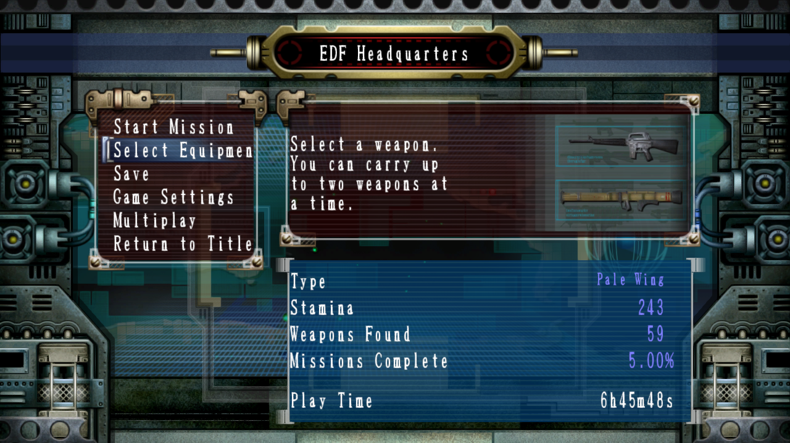
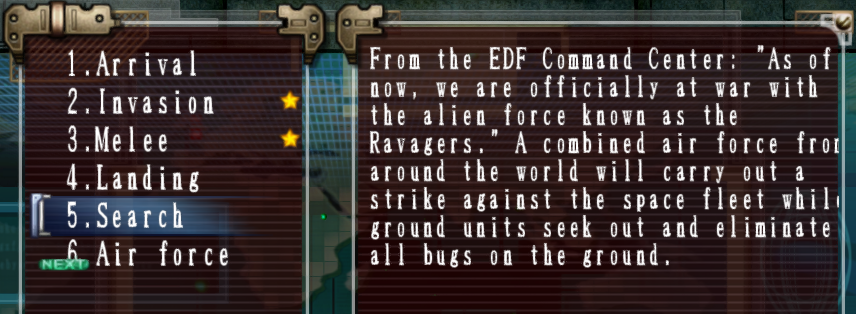
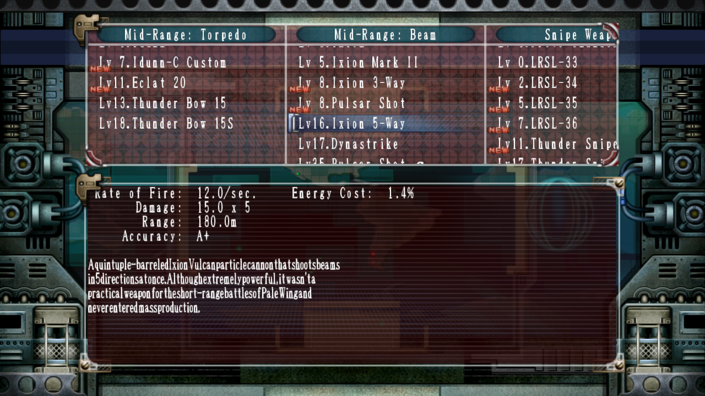
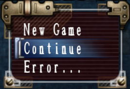
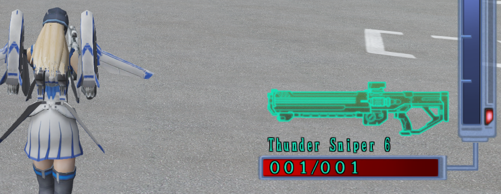
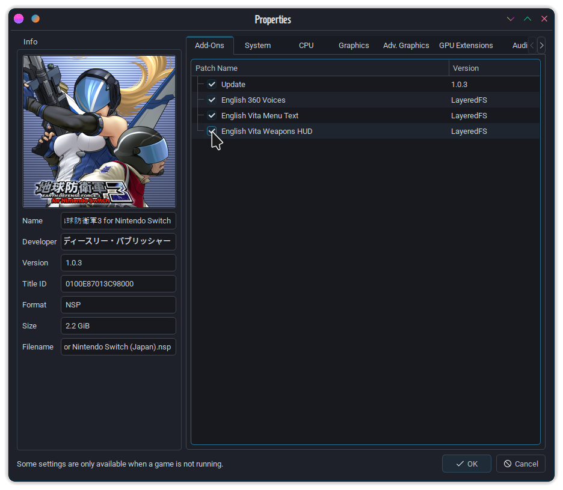

# English EDF3 for NX

These patches will translate parts of *地球防衛軍3 (EARTH DEFENSE FORCE 3) FOR NINTENDO SWITCH* to (mostly working) English for Earthly American enjoyers.

EDF3 for NS seems to be clearly based on the PlayStation Vita version of *Earth Defense Force 2017 Portable* - which is apparent as soon as one creates a RomFS dump, revealing a small trove of Vita LiveArea and Save Icon assets (from the US *EDF* branding, no less, and not the 地球防衛軍--*Chikyuu Bouei-gun* that's native to Japan) are included in the NS port. That said, it's the one with the closest to the 360 Presentation, while being capable of running at better-than-360 framerates, and having the addition of the Pale Wing *from the start* without having to complete a full Storm playthrough first.

Assets are transplanted either directly or through conversion technology from the Xbox 360 *EDF2017* and/or the Vita *EDF2017-Portable* version.

Keep in mind that as of writing, these patches currently **do not** address the following:
- The title graphic still uses the Switch-exclusive Japanese branding, though the moniker "Earth Defense Force" is still in the title at least.
- The Multiplay menu graphics (and probably whole sections, see Menu Text caveats) are *not* translated, which would be difficult to use anyways on emulation.
- Tutorial/tips slides in loading screens will remain in full Japanese - ideally, at least some imports from the 360 version would be nice, even if the glyphs would no longer necessarily match precisely.

## List of Patches
### English 360 Voices
This patches over the main scenario and incidental dialogue from the US Xbox 360 release of *Earth Defense Force 2017* to the Switch port, which covers all the menu tips/dialogue, soldier banter, and scripted/gameplay cutscenes. The 360 version was chosen primarily for its quality - being maintained in uncompressed WAV format rather than the highly compressed Vita counterparts - then batch-script converted to Little Endian unlooping BFSTM using [BFSTMConverter](https://github.com/CVFireDragon/BFSTMConverter)
###### (or so I remember anyways, it's been a hot minute).

### English Vita Menu Text

This patches over the main menus (title screen, Load/Save, pause, options, and Mission Titles & Briefings) with direct imports from the US PS Vita *EDF2017-Portable,* which was chosen for content parity with the addition/maintaining of the Pale Wing unit and her weapon roster. This patch, while *functional* and will allow for navigable casual play, does have some side effects:

| Example | Description |
|---------------------------------------------------|---|
| | You'll notice some occasional text overflow in the Mission Briefings. These are largely inconsequential, but may be annoying to some.|
|     | Weapon descriptions will be *extra condensed*, due in large part to a difference in fonts and how spacing for description fields in particular are handled. Much of the descriptive text will be hard to see, but the names and stats are still perfectly legible.|
|    | Some fields of text will be replaced with `Error...`, which stems from the Vita file not accounting for some of the strings added to the Switch port. These include the Manual option on the title menu, the option to enable Gyro aim and its Gyro speed setting, and assigning custom controls to buttons that didn't exist on the Vita like the secondary triggers and stick clicks. &nbsp;&nbsp;&nbsp;&nbsp;- Incidentally, the action buttons will also now use PlayStation symbol glyphs as a result. |

### English Vita Weapons HUD

This patches over the HUD graphics for weapons from the US PS Vita *EDF2017-Portable,* which translates the weapon names shown in gameplay from their original Japanese to English.

As far as I'm aware, this seems to work just fine for both Storm and Pale Wing arms without any adverse effects.

## Installation
Download a copy of this repository, either directly via `git` or by clicking GitHub's green *"Code"* icon, then *"Download ZIP"*. Extract/move the folders of this Git repo according to the following, depending on your choice of hardware or emulation:
- **If you're running a modified NS running Atmosphere:** the mods you want to use will have to be merged into the root of a folder called `0100E87013C98000`, meaning the only subdirectory in that folder should be `romfs`; copy this newly merged folder into the `atmosphere/contents` directory of your SD Card (or create the path if it doesn't exist, which it might not if this is your first time modding a Switch game).

- **If you're running on some form of emulation:** for Yuzu forks, refer to the directory in your settings for *Mod Load Root,* which by default will be in `$yuzuForkname/load`. Once located, create a new folder called `0100E87013C98000`, then put the contents of the repo into this directory. Open the emulator, and make sure that your EDF3 dump is present in your defined Game Directories; right-click the *地球防衛軍3 for Nintendo Switch* entry and select *Configure Game*, and you'll see the list of addons for the game will now include the patches.
  - Make sure you enable the ones you want to use and save this game configuration before playing, or they won't take effect!
